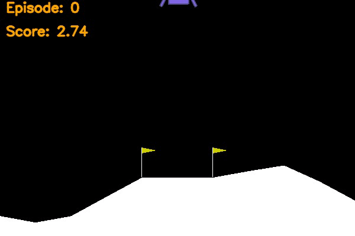
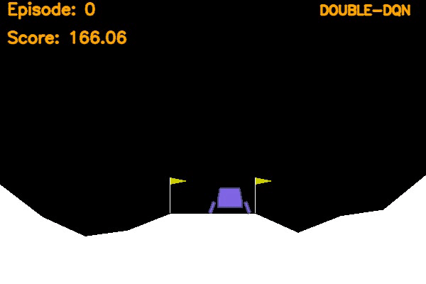
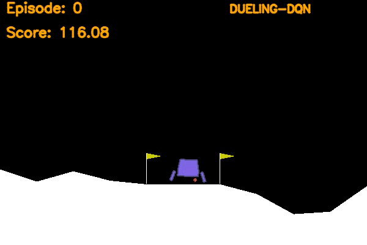
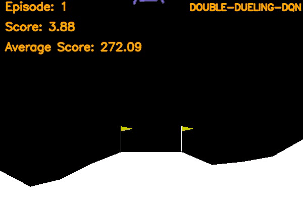
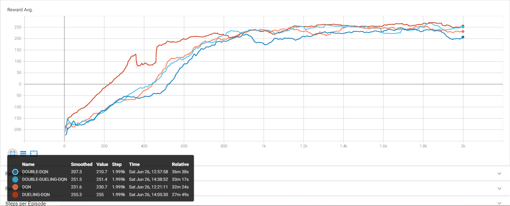

- 👋 Hi, I’m @TnSor06
- 👀 I’m interested in AI🧠 and Robotics🤖
- 🌱 I’m currently learning Deep Reinforcement Learning
- 💞️ I’m looking to collaborate on more Reinforcement Learning Projects
- ✔  [DQN + Double DQN + Dueling DQN + Double Dueling DQN](https://tnsor06.github.io/LunarLanderV2-DQN/) 
- 🚧 More DQN Projects on the way

# LunarLander-v2 Deep Reinforcement Learning

This project uses Deep Reinforcement Learning to solve the Lunar Lander environment of the OpenAI-Gym
Any of the four methods can be used in this project:
1. Deep Q Learning
2. Double Deep Q Learning
3. Dueling Deep Q Learning
4. Double Dueling Deep Q Learning

|Before training            |
|:-------------------------:|
|| 

|DQN                         |Double DQN                  |
|:--------------------------:|:--------------------------:|
|         |  | 

|Dueling DQN                 |Double Dueling DQN          |
|:--------------------------:|:--------------------------:|
| || 


## Environment

The Agent's interaction with the Environment is based on the following four discrete actions:
1. `0`: Do Nothing
2. `1`: Fire Left Orientation Engine
3. `2`: Fire Main Engine
4. `3`: Fire Right Orientation Engine.

The Environment returns the state vector of length 8 with continuous variable ranging from [-1,+1]: 
1. `0`: X co-ordinate of Lander 
2. `1`: X co-ordinate of Lander
3. `2`: Vertical Velocity of Lander
4. `3`: Horizontal Velocity of Lander
5. `4`: Angle of Lander
6. `5`: Angular Velocity of Lander
7. `6`: Left Lander Leg contact with Ground
8. `7`: Right Lander Leg contact with Ground

More information is available on the OpenAI [LunarLander-v2](https://gym.openai.com/envs/LunarLander-v2/), or in the [Github](https://github.com/openai/gym/blob/master/gym/envs/box2d/lunar_lander.py).

The episode finishes if the lander crashes or comes to rest. 
Normally, LunarLander-v2 defines "solving" as getting an average reward of 200 over an average of 100 consecutive episodes. But to improve the efficiency of the agent certain punishments were added in the reward section.

```python
# main.py at line 36
# Reward Punishing for Moving Vertically away from zero
# Range is [-1.00 to +1.00] with center at zero to maximize efficiency
reward -= abs(obs[0])*0.05
```
`obs` is the state received from the environment. Absolute is taken to penalize getting away from the center with a small scalar magnitude.

**NOTE**: *Replay Buffer Code in utils.py is taken from Udacity's [Course Code](https://github.com/udacity/deep-reinforcement-learning/blob/master/dqn/solution/dqn_agent.py).*

## Requirements

The Project uses the following libraries:
1. Pytorch
2. Tensorboard
3. OpenAI-Gym
4. OpenCV-Python
5. Numpy
6. Box2d-Py(For Google Colab)

Use the requirements.txt file to install the required libraries for this project.

```bash
pip install -r requirements.txt
```

## Arguments
```
python main.py
usage: main.py [-h] [-a ] [-n ] [-t ] [--seed ] [--scores_window ] [--n_games ] [--limit_steps ] [--gamma ]
               [--epsilon ] [--eps_end ] [--eps_dec ] [--batch_size ] [--n_epochs ] [--update_every ]
               [--max_mem_size ] [--tau ] [--lr ] [--fc1_dims ] [--fc2_dims ]

Solving Lunar Lander using Deep Q Network

optional arguments:
  -h, --help            show this help message and exit
  -a [], --agent_mode []
                        Enter Agent Type: SIMPLE or DOUBLE (default: SIMPLE)
  -n [], --network_mode []
                        Enter Network Type: SIMPLE or DUELING (default: SIMPLE)
  -t [], --test_mode []
                        Enter Mode Type: TEST or TRAIN (default: TEST)
  --seed []             Initialize the Random Number Generator (default: 0)
  --scores_window []    Lenght of scores window for evaluation (default: 100)
  --n_games []          Number of games to run on (default: 2000)
  --limit_steps []      Number of steps per run (default: 1000)
  --gamma []            Discount Factor for Training (default: 0.99)
  --epsilon []          Exploration Parameter Initial Value (default: 0.9)
  --eps_end []          Exploration Parameter Minimum Value (default: 0.01)
  --eps_dec []          Exploration Parameter Decay Value (default: 0.995)
  --batch_size []       Number of samples per learning step (default: 64)
  --n_epochs []         Number of epochs per learning step (default: 5)
  --update_every []     Number of steps to Update the Target Network (default: 5)
  --max_mem_size []     Memory size of Replay Buffer (default: 100000)
  --tau []              Parameter for Soft Update of Target Network (default: 0.001)
  --lr []               Learning Rate for Training (default: 0.0005)
  --fc1_dims []         Number of Nodes in First Hidden Layer (default: 64)
  --fc2_dims []         Number of Nodes in Second Hidden Layer (default: 64)
```

## Usage
**NOTE**: *Epsilon and N_games are by default set to 1.0 and 2000 for training mode, 0.0 and 5 for testing mode respectively unless changed by passing as arguments.*
### For Training Mode
```bash
# For Basic DQN
python3 main.py --test_mode=TRAIN --agent_mode=SIMPLE --network_mode=SIMPLE

# For Double DQN
python3 main.py --test_mode=TRAIN --agent_mode=DOUBLE --network_mode=SIMPLE

# For Dueling DQN
python3 main.py --test_mode=TRAIN --agent_mode=SIMPLE --network_mode=DUELING

# For Double Dueling DQN
python3 main.py --test_mode=TRAIN --agent_mode=DOUBLE --network_mode=DUELING
```
### For Tesing Mode
```bash
# For Basic DQN
python3 main.py --test_mode=TEST --agent_mode=SIMPLE --network_mode=SIMPLE

# For Double DQN
python3 main.py --test_mode=TEST --agent_mode=DOUBLE --network_mode=SIMPLE

# For Dueling DQN
python3 main.py --test_mode=TEST --agent_mode=SIMPLE --network_mode=DUELING

# For Double Dueling DQN
python3 main.py --test_mode=TEST --agent_mode=DOUBLE --network_mode=DUELING
```

## Results

|Average Reward             |
|:-------------------------:|
|    | 

### For Visualizing the Training using Tensorboard
```bash
tensorboard --logdir=logs
```

## Contributing
Pull requests are welcome. For major changes, please open an issue first to discuss what you would like to change.

## Resources

- [Human-Level Control through Deep Reinforcement Learning](https://storage.googleapis.com/deepmind-media/dqn/DQNNaturePaper.pdf)
- [Deep Reinforcement Learning with Double Q-Learning](https://arxiv.org/abs/1509.06461)
- [Dueling Network Architectures for Deep Reinforcement Learning](https://arxiv.org/abs/1511.06581)